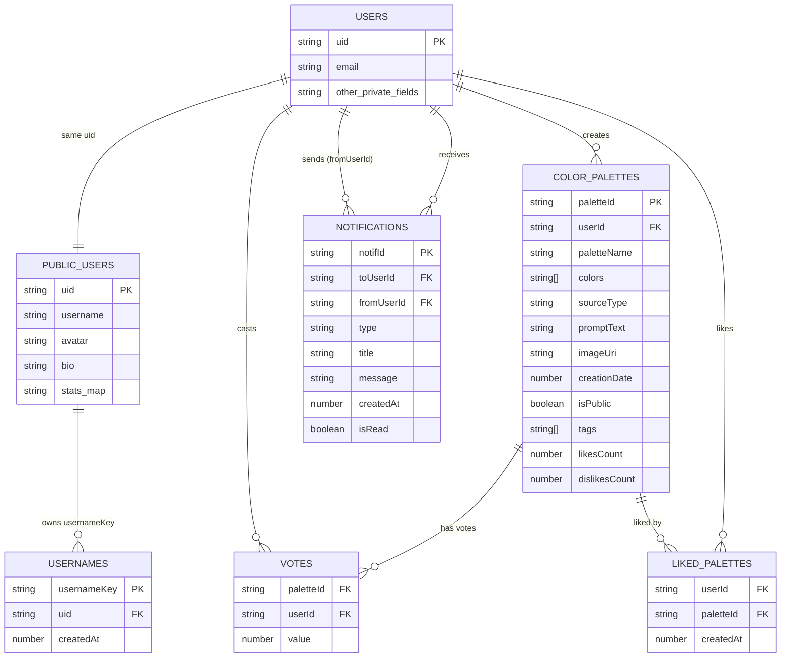

# VColorAI — генератор цветовых палитр (Android)

VColorAI — мобильное приложение на Android, которое генерирует цветовые палитры:
- по текстовому описанию (prompt),
- по фотографии (из галереи или с камеры),
- в комбинированном режиме (фото + текстовые модификаторы).

В приложении есть публичная лента палитр, профили пользователей, реакции (лайки/дизлайки), уведомления и гостевой режим (без сохранения в БД).

---

## Ключевые возможности

### Генерация палитр
- **Text mode**: генерация нескольких вариантов палитры по описанию.
- **Image mode**: извлечение доминирующих цветов с фото (Palette API).
- **Combined mode**: модификация палитры фото на основе текста (warm/cool/dark/light и т.п.).
- Копирование HEX-цветов в буфер обмена.
- Просмотр изображения на весь экран.

### Публичная лента
- Просмотр опубликованных палитр пользователей.
- Поиск по:
  - названию палитры,
  - описанию,
  - тегам,
  - нику автора.
- Открытие профиля через `@username` (открывает карточку профиля снизу).
- Сортировка и фильтрация:
  - по дате,
  - по лайкам/дизлайкам/рейтингу,
  - только с фото / только текст,
  - только с тегами / без тегов,
  - фильтр по конкретному тегу.

### Профиль пользователя
- Редактирование ника и аватара.
- Просмотр своих палитр.
- Публикация/снятие с публикации (палитру нельзя публиковать дважды).
- Статистика (лайки/дизлайки и т.п. — если включено в проекте).

### Уведомления
- Уведомления о действиях других пользователей (например, лайк на вашу палитру).
- Экран уведомлений, отметка о прочтении.

### Гостевой режим
- Полностью повторяет экран генерации (UI один в один),
- **но ничего не сохраняет в базу** (ни палитры, ни действия).

---

## Технологии
- **Android / Kotlin**
- UI: Fragments, RecyclerView, BottomNavigation
- **Firebase Authentication**
- **Firestore** (палитры, профили, username-индекс, лайки/дизлайки, уведомления)
- **Glide** (загрузка изображений)
- **ImgBB** (хостинг изображений для публикаций)
- **AndroidX Palette** (извлечение цветов из фото)
- **Yandex GPT API** (генерация палитр при наличии интернета, чат бот)

---

## Структура проекта

## Структура проекта
- com.example.vcolorai
- ├─ cache
- │ └─ ImageCacheManager.kt
- │
- ├─ data
- │ └─ model
- │ ├─ AppNotification.kt
- │ ├─ PublicPalette.kt
- │ └─ SavedPalette.kt
- │
- ├─ net
- │─ ImgBBUploader.kt
- │ └─ YandexPaletteClient.kt
- │
- ├─ (activities)
- │ ├─ GuestActivity.kt
- │ ├─ MainActivity.kt
- │ └─ SplashActivity.kt
- │
- ├─ ui
- │ ├─ auth
- │ │ ├─ ChooseAccountActivity.kt
- │ │ ├─ ForgotPasswordDialogFragment.kt
- │ │ ├─ LoginActivity.kt
- │ │ ├─ RegisterActivity.kt
- │ │ └─ ResetPasswordActivity.kt
- │ │
- │ ├─ bot
- │ │ ├─ ChatAdapter.kt
- │ │ └─ IdeasBotFragment.kt
- │ │
- │ ├─ common
- │ │ ├─ BaseFragment.kt
- │ │ ├─ FullscreenImageDialog.kt
- │ │ ├─ LoadingDialog.kt
- │ │ └─ VoteManager.kt
- │ │
- │ ├─ generation
- │ │ ├─ GenerationFragment.kt
- │ │ ├─ GuestGenerationFragment.kt
- │ │ ├─ PaletteGenerator.kt
- │ │ └─ PaletteView.kt
- │ │
- │ ├─ notifications
- │ │ ├─ NotificationItem.kt
- │ │ ├─ NotificationsAdapter.kt
- │ │ └─ NotificationsFragment.kt
- │ │
- │ ├─ palettes
- │ │ ├─ PaletteDetailDialogFragment.kt
- │ │ ├─ PalettesAdapter.kt
- │ │ └─ PalettesFragment.kt
- │ │
- │ ├─ profile
- │ │ ├─ ProfileFragment.kt
- │ │ ├─ PublicUserProfileBottomSheet.kt
- │ │ ├─ PublicUserProfileFragment.kt
- │ │ └─ UserProfileBottomSheetDialogFragment.kt
- │ │
- │ ├─ publicfeed
- │ │ ├─ PublicFeedAdapter.kt
- │ │ └─ PublicFeedFragment.kt
- │ │
- │ └─ settings
- │ ├─ EditProfileDialogFragment.kt
- │ ├─ SettingsFragment.kt
- │ └─ UserStatsDialogFragment.kt
- │
- ├─ (fragments root)
- │ ├─ GalleryFragment.kt
- │ ├─ HomeFragment.kt
- │ └─ RulesFragment.kt
- │
- └─ util
- ├─ ColorKeywordLookup.kt
- ├─ ColorUtils.kt
- ├─ EmailSender.kt
- └─ TextPaletteGenerator.kt

  
---

---

### Основные коллекции FireBase

#### `color_palettes/{paletteId}`
Палитры пользователей (и приватные, и публичные).

**Поля документа:**
- `userId` *(string)* — UID владельца палитры  
- `paletteName` *(string)* — название  
- `colors` *(array<string>)* — список цветов в формате `#RRGGBB`  
- `sourceType` *(string)* — источник генерации: `text | image | combined`  
- `promptText` *(string)* — текст запроса (для `text`/`combined`)  
- `imageUri` *(string)* — ссылка на изображение (для `image`/`combined`, может быть пустой)  
- `creationDate` *(number/timestamp)* — дата создания (timestamp / millis)  
- `isPublic` *(bool)* — опубликована ли палитра в ленту  
- `tags` *(array<string>)* — теги  
- `likesCount` *(number)* — количество лайков  
- `dislikesCount` *(number)* — количество дизлайков  

---

#### `color_palettes/{paletteId}/votes/{userId}`
Голос конкретного пользователя за конкретную палитру.

**Поля документа:**
- `value` *(number)* — `1` (лайк) или `-1` (дизлайк)

---

#### `users/{uid}`
Приватные данные пользователя (не для публичного просмотра).

> Состав полей зависит от реализации профиля/настроек в приложении.

---

#### `users/{uid}/liked_palettes/{paletteId}`
Индекс «лайкнутых» палитр для быстрого доступа/подсчётов.

**Поля документа:**
- `createdAt` *(number/timestamp)* — когда пользователь лайкнул палитру

---

#### `users/{uid}/notifications/{notifId}`
Уведомления пользователя (лайки/дизлайки/подписки и т.д.)

**Поля документа:**
- `fromUserId` *(string)* — UID инициатора события  
- `type` *(string)* — тип уведомления: `like | dislike | follow | ...`  
- `title` *(string)* — заголовок  
- `message` *(string)* — текст уведомления  
- `createdAt` *(number/timestamp)* — дата создания  
- `isRead` *(bool)* — прочитано ли уведомление  

---

#### `public_users/{uid}`
Публичный профиль пользователя (видим другим).

**Типичные поля:**
- `username` *(string)* — ник  
- `avatar` *(string)* — ссылка на аватар  
- `bio` *(string)* — описание  
- `stats` *(map)* — статистика (если используется)

---

#### `usernames/{usernameKey}`
Уникальность ников + быстрый поиск по `@username`.

**Поля документа:**
- `uid` *(string)* — UID владельца ника  
- `createdAt` *(number/timestamp)* — когда ник был занят  

> `usernameKey` — нормализованный ключ ника (например, lowercase без пробелов), чтобы обеспечить уникальность и удобный поиск.

**Схема базы данных**
Cхема связей основных моделей (ER‑диаграмма):

**Сборка и запуск (Android)**
**Требования**

- Android Studio
- minSdk / targetSdk — по настройкам проекта
- google-services.json добавлен в app/
- Firebase проект настроен (Auth + Firestore)

**Внешние ключи**
- ImgBB API key (для ImgBBUploader)
- (опционально) ключ/endpoint для онлайн-генерации в YandexPaletteClient

**Запуск**
- Открыть проект в Android Studio.
- Sync Gradle.
- Запустить на эмуляторе/устройств

**Важно про Guest Mode**
Гостевой режим использует ту же UI-логику генерации (text/image/combined),
но не вызывает сохранение в Firestore и не требует авторизации.

